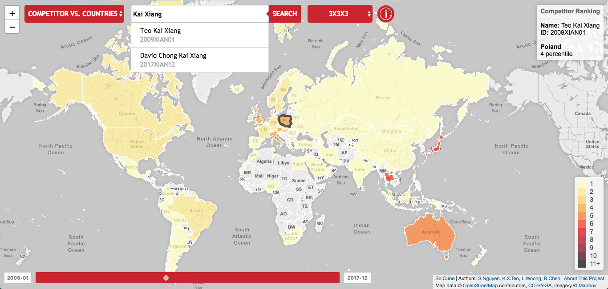
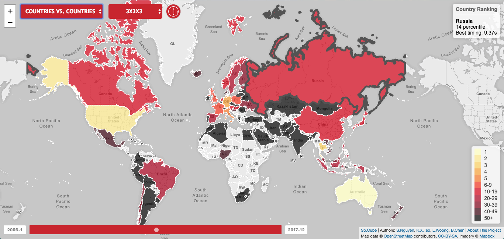

# 🌏 so.cube 🌏

This is a data visualization project with the aim of answering these questions:
What is the journey of a professional cuber? Given historical data of a specific
cuber and the results of cubing competitions all over the world, how does a
professional cuber measure up to their peers at that time? Are there any
geospatial patterns in a cuber’s career?

We used data from [World's Cube Association](https://www.worldcubeassociation.org/)
, or WCA for short. Since 2006, WCA has been the official record keeper and
organizers for cubing competitions worldwide. Their data includes every registered
competitors’ timing at various competitions, records broken at different
competitions as well as the competition venue. It was perfect for our
visualization that we intend to make – the timings of a professional cuber against
a world map, over the course of his career as a monthly slider.

To further answer our questions we also plot countries best timings to find out the top countries in speedcubing.

So, hang around and play with the slider. If you are a WCA registered competitor,
enter your name and see for yourself your timings against the world.

### Team Member

* [Brian Chen](http://github.com/vegggram)
* [Lumo Woong](http://github.com/lumotheninja)
* [Teo Kai Xiang](http://github.com/kai32)
* [Stanley Nguyen](http://github.com/stanleynguyen)

### Acknowledgement

SUTD 02.221 Making Maps Course Instructor: Prof. [Ate Poorthuis](https://hass.sutd.edu.sg/faculty/ate-poorthuis/)
